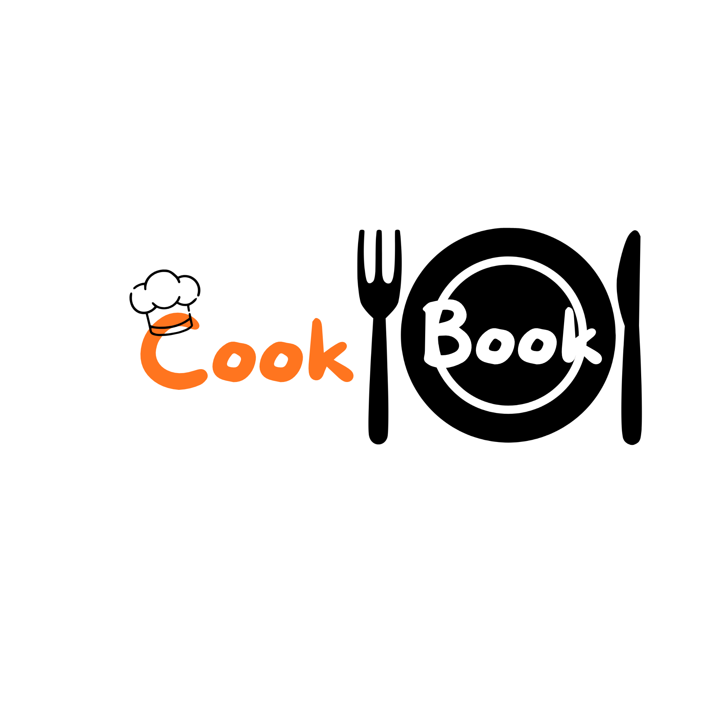

  <picture>
    
  </picture>

    

O presente trabalho insere-se no âmbito do Projeto Multidisciplinar do 3.º semestre da Licenciatura em Engenharia Informática (LEI) do IADE (2026/2027). O projeto consiste no desenvolvimento de uma aplicação móvel orientada para a gestão personalizada de receitas culinárias e para a partilha comunitária entre utilizadores.

---
# Status
Este projeto encontra-se em fase de planeamento com o fim de desenvolvimento previsto para 11 de dezembro

| Entrega | Data | Conteúdo |
|---|---|---|
| Primeira Entrega | 02 October 2026 | Relatorio da proposta do projeto, Mockups, Requisitos |
| Segunda Entrega | 6 Novembro 2026 | Prototipo funcional com BD e servidor, Relatorio atualizado |
| Terceira Entrega | 11 Dezembro 2026 | Versão final do projeto, relatorio e suportes visuais |

---
# Documentação 

|||
|---|---|
|[Memoria descritiva](01_Memoria_Descritiva/memoria.md) |  |
| [Info](00_Identificacao/info.md) ||
